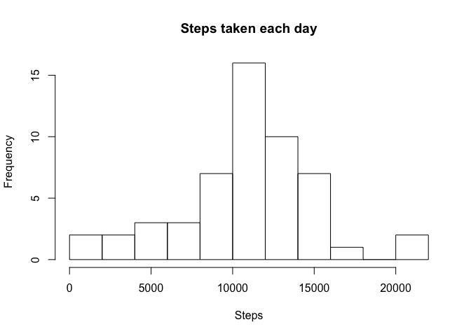

###Loading and preprocessing the data

Loading and converting to date the date column:

```r
setwd("~/Documents/R/Coursera")
activity <- read.csv("~/Documents/R/Coursera/activity.csv")
activity$date <- as.Date(activity$date)
library(ggplot2)
```

###What is the mean total number of steps taken per day?

Calculating the total number of steps and creating an histogram:

```r
stepsday <- aggregate(activity$steps, by = list(date = activity$date), FUN = sum)
colnames(stepsday)[2] <- "steps"
hist(stepsday$steps, main = "Steps taken each day", xlab = "Steps",
     breaks = 10)
```

<!-- -->

Calculating the mean and median number of steps taken each day:

```r
mean(stepsday$steps, na.rm = TRUE)
```

```
## [1] 10766.19
```

```r
median(stepsday$steps, na.rm = TRUE)
```

```
## [1] 10765
```

The **mean** number of steps taken each day is **10766 steps** and the **median** is **10765 steps**.

###What is the average daily activity pattern?

Calculating the average number of steps taken per 5-minute interval, averaged across all days and making a time series plot:

```r
steps5min <- aggregate(activity$steps, by = list(interval = activity$interval), 
                      FUN = mean, na.rm = TRUE)
colnames(steps5min)[2] <- "steps"
ggplot(data = steps5min, aes(x = interval, y = steps)) + geom_line()
```

<!-- -->

Calculating the 5-minute interval which, on average across all the days in the dataset, contains the maximum number of steps:

```r
max(steps5min$steps)
```

```
## [1] 206.1698
```

```r
which(steps5min$steps == max(steps5min$steps))
```

```
## [1] 104
```

```r
steps5min$interval[which(steps5min$steps == max(steps5min$steps))]
```

```
## [1] 835
```

The maximum average number of steps is 206.1698, found on the 104th interval, that corresponds to the 5-minute **interval** of **835**.

###Imputing missing values

Calculating the total number of rows with missing values:

```r
sum(!complete.cases(activity))
```

```
## [1] 2304
```

There are **2304 rows** with missing values.  

Replacing the missing values with the average number of steps of a similar 5-minute interval:

```r
newactivity <- activity
for (i in 1:nrow(activity)) {
    if (is.na(activity$steps[i])) {
        newactivity$steps[i] <- steps5min[which(steps5min$interval == activity$interval[i]),2]
    }
}
```

Calculating the total number of steps taken each day and creating an histogram:

```r
newstepsday <- aggregate(newactivity$steps, by = list(date = newactivity$date), FUN = sum)
colnames(newstepsday)[2] <- "steps"
hist(newstepsday$steps, main = "Steps taken each day", xlab = "Steps",
     breaks = 10)
```

<!-- -->

Calculating the mean and median number of steps taken each day:

```r
mean(newstepsday$steps)
```

```
## [1] 10766.19
```

```r
median(newstepsday$steps)
```

```
## [1] 10766.19
```

The **mean** number of steps taken each day is **10766 steps** and the **median** is also **10766 steps**. Compared to the **mean 10766 steps** and the **median 10765 steps**, little change happened, which was expected. Imputing missing data on the estimates of the total daily number of steps had very little impact.

###Are there differences in activity patterns between weekdays and weekends?

Creating a new factor with two levels – “weekday” and “weekend” indicating whether a given date is a weekday or weekend day

```r
for (i in 1:nrow(newactivity)) {
    if (weekdays(newactivity$date[i]) %in% c("Saturday","Sunday")) {
        newactivity$weekend[i] <- "weekend"
    }
    else {
        newactivity$weekend[i] <- "weekday"
    }
}
newactivity$weekend <- factor(newactivity$weekend)
```

Calculating the average number of steps taken per 5-minute interval, averaged across all weekdays  and weekends and making a time series plot:

```r
newsteps5min <- aggregate(newactivity$steps, by = list(newactivity$interval, newactivity$weekend), FUN = mean)
colnames(newsteps5min) <- c("Interval","Weekend","Steps")
ggplot(data = newsteps5min, aes(x = Interval, y = Steps)) + geom_line() +
    facet_grid(Weekend ~ .)
```

<!-- -->
